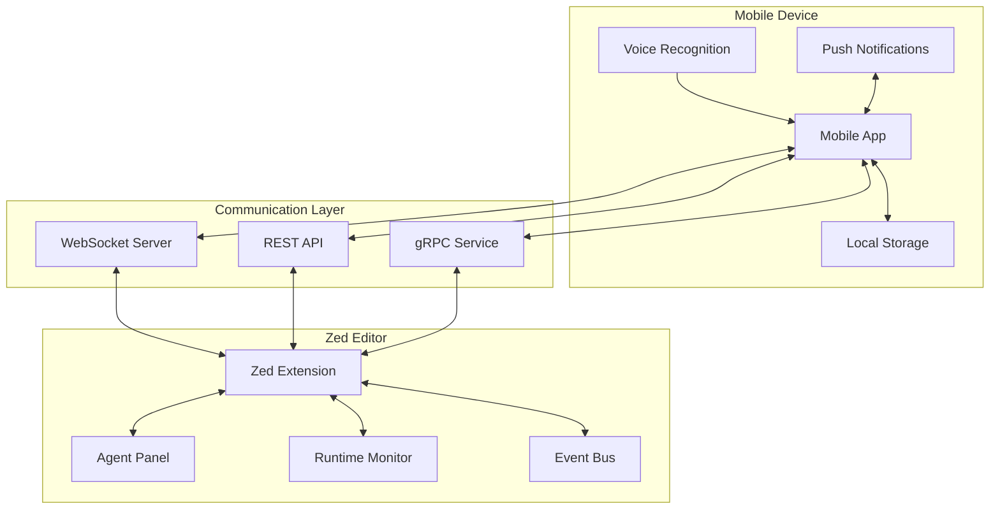

# Zed Mobile Architecture

## Overview

Zed Mobile is designed as a companion application that provides mobile access to Zed editor's runtime information, with initial focus on the agentic panel. The architecture prioritizes real-time communication, extensibility, and a clean separation between the mobile client and Zed editor.

## High-Level Architecture



## Core Components

### 1. Mobile Application Layer

#### 1.1 Flutter Implementation (Option A)
```dart
// Core architecture using Clean Architecture pattern
lib/
├── domain/           # Business logic and entities
│   ├── entities/
│   ├── repositories/
│   └── usecases/
├── data/            # Data layer implementation
│   ├── datasources/
│   ├── models/
│   └── repositories/
├── presentation/    # UI layer
│   ├── screens/
│   ├── widgets/
│   └── providers/
└── core/           # Shared utilities
    ├── errors/
    ├── network/
    └── utils/
```

#### 1.2 Kotlin Multiplatform Implementation (Option B)
```kotlin
// Shared module structure
shared/
├── commonMain/     # Common business logic
├── androidMain/    # Android-specific implementations
├── iosMain/       # iOS-specific implementations
└── commonTest/    # Shared tests

// Platform-specific apps
androidApp/        # Android UI (Jetpack Compose)
iosApp/           # iOS UI (SwiftUI)
```

### 2. Communication Protocol

#### 2.1 WebSocket Protocol
```typescript
// Message types for real-time communication
interface WebSocketMessage {
  type: MessageType;
  sessionId: string;
  timestamp: number;
  payload: MessagePayload;
}

enum MessageType {
  AGENT_OUTPUT = "agent_output",
  TOOL_CALL = "tool_call",
  USER_INPUT = "user_input",
  SYSTEM_EVENT = "system_event",
  HEARTBEAT = "heartbeat"
}

interface AgentOutput {
  content: string;
  metadata: {
    model: string;
    tokens: number;
    latency: number;
  };
}
```

#### 2.2 gRPC Service Definition
```protobuf
syntax = "proto3";

package zedmobile;

service AgentPanelService {
  // Bidirectional streaming for real-time updates
  rpc StreamPanelUpdates(stream PanelRequest) returns (stream PanelUpdate);

  // Unary calls for specific operations
  rpc SendCommand(CommandRequest) returns (CommandResponse);
  rpc GetSessionHistory(SessionHistoryRequest) returns (SessionHistoryResponse);
  rpc GetAgentStatus(Empty) returns (AgentStatus);
}

message PanelUpdate {
  string session_id = 1;
  UpdateType type = 2;
  google.protobuf.Timestamp timestamp = 3;

  oneof content {
    UserMessage user_message = 4;
    AssistantMessage assistant_message = 5;
    ToolCall tool_call = 6;
    SystemNotification notification = 7;
  }
}

message ToolCall {
  string id = 1;
  string name = 2;
  map<string, google.protobuf.Value> parameters = 3;
  ToolCallStatus status = 4;
  repeated Diff diffs = 5;
}
```

### 3. Zed Extension Architecture

```rust
// Extension structure
extension/
├── src/
│   ├── lib.rs              // Extension entry point
│   ├── server.rs           // WebSocket/gRPC server
│   ├── panel_monitor.rs    // Agent panel monitoring
│   ├── event_stream.rs     // Event streaming logic
│   └── protocol/           // Protocol definitions
│       ├── mod.rs
│       └── messages.rs
├── Cargo.toml
└── extension.json

// Core monitoring trait
pub trait PanelMonitor: Send + Sync {
    fn subscribe_to_updates(&self) -> BoxStream<'static, PanelUpdate>;
    fn send_command(&self, command: Command) -> BoxFuture<'static, Result<Response>>;
    fn get_session_state(&self) -> SessionState;
}

// Event streaming implementation
pub struct AgentPanelMonitor {
    panel: Arc<RwLock<AgentPanel>>,
    event_tx: broadcast::Sender<PanelEvent>,
}

impl AgentPanelMonitor {
    pub fn new(panel: Entity<AgentPanel>) -> Self {
        let (tx, _) = broadcast::channel(1024);
        // Setup panel observation
        Self {
            panel: Arc::new(RwLock::new(panel)),
            event_tx: tx,
        }
    }
}
```

## Data Flow

### 1. Real-time Updates Flow
```
1. Agent Panel Event (Zed)
   ↓
2. Extension Event Handler
   ↓
3. Protocol Serialization
   ↓
4. WebSocket/gRPC Transmission
   ↓
5. Mobile App Reception
   ↓
6. State Update (Redux/Riverpod)
   ↓
7. UI Rendering
```

### 2. Command Execution Flow
```
1. User Input (Voice/Text)
   ↓
2. Input Processing
   ↓
3. Command Construction
   ↓
4. Network Transmission
   ↓
5. Extension Command Handler
   ↓
6. Zed API Invocation
   ↓
7. Response Processing
   ↓
8. Mobile App Update
```

## State Management

### Mobile App State
```typescript
interface AppState {
  connection: ConnectionState;
  sessions: Map<string, Session>;
  activeSession: string | null;
  user: UserPreferences;
  cache: CacheState;
}

interface Session {
  id: string;
  entries: AgentThreadEntry[];
  status: SessionStatus;
  metadata: SessionMetadata;
}

interface ConnectionState {
  status: 'connected' | 'disconnected' | 'reconnecting';
  latency: number;
  lastHeartbeat: number;
}
```

### Synchronization Strategy
1. **Optimistic Updates**: Apply UI changes immediately, reconcile with server
2. **Event Sourcing**: Store all events for replay and debugging
3. **Offline Support**: Queue commands when disconnected
4. **Conflict Resolution**: Last-write-wins with version vectors

## Security Considerations

### 1. Authentication & Authorization
```yaml
authentication:
  methods:
    - api_key       # Simple API key authentication
    - oauth2        # OAuth 2.0 for production
    - device_cert   # Certificate-based for enterprise

authorization:
  roles:
    - viewer        # Read-only access
    - operator      # Can send commands
    - admin         # Full control
```

### 2. Encryption
- **Transport**: TLS 1.3 for all network communication
- **Storage**: AES-256 for local data encryption
- **Keys**: Secure key storage using platform KeyStore/Keychain

### 3. Data Privacy
- No telemetry without explicit consent
- Local-first data storage
- Configurable data retention policies
- GDPR compliance for EU users

## Performance Optimization

### 1. Mobile Optimizations
- **Lazy Loading**: Load session history on demand
- **Pagination**: Limit message batch sizes
- **Compression**: gzip/brotli for large payloads
- **Caching**: Strategic caching of frequently accessed data

### 2. Network Efficiency
```rust
// Batching and throttling
pub struct MessageBatcher {
    buffer: Vec<PanelUpdate>,
    max_batch_size: usize,
    flush_interval: Duration,
}

impl MessageBatcher {
    pub fn add(&mut self, update: PanelUpdate) {
        self.buffer.push(update);
        if self.buffer.len() >= self.max_batch_size {
            self.flush();
        }
    }
}
```

### 3. Resource Management
- Connection pooling for multiple Zed instances
- Automatic reconnection with exponential backoff
- Memory-aware caching with LRU eviction
- Battery-conscious update frequencies

## Scalability Considerations

### 1. Multi-Instance Support
```yaml
instances:
  discovery:
    - mdns          # Local network discovery
    - manual        # Manual IP configuration
    - cloud_broker  # Cloud-based instance registry

  routing:
    strategy: round_robin
    failover: automatic
    health_check_interval: 30s
```

### 2. Horizontal Scaling
- Stateless extension design
- Redis/NATS for pub/sub across instances
- Load balancing at connection level

## Testing Strategy

### 1. Unit Testing
- Business logic isolation
- Mock network layers
- Protocol compliance tests

### 2. Integration Testing
- End-to-end message flow
- Network failure scenarios
- Performance benchmarks

### 3. UI Testing
- Widget testing (Flutter)
- UI testing (Kotlin)
- Accessibility compliance

## Deployment Architecture

### 1. Mobile App Distribution
- **iOS**: App Store with TestFlight beta
- **Android**: Google Play with staged rollout
- **Enterprise**: MDM distribution

### 2. Extension Distribution
- Zed extension marketplace
- GitHub releases for development
- Private registry for enterprise

## Future Considerations

### 1. Extended Panel Support
- Terminal panel integration
- Diagnostics panel
- Search results panel
- Custom panel API

### 2. Collaboration Features
- Multi-user sessions
- Screen sharing capabilities
- Collaborative debugging

### 3. AI Enhancement
- On-device ML for command prediction
- Smart notifications
- Usage pattern analysis

## Technology Decisions

### Why WebSocket + gRPC?
- WebSocket for real-time bidirectional streaming
- gRPC for structured RPC calls
- Fallback to REST for compatibility

### Why Protocol Buffers?
- Language-agnostic serialization
- Efficient binary format
- Strong typing and versioning

### Why Event Sourcing?
- Complete audit trail
- Easy debugging and replay
- Offline resilience

## Conclusion

This architecture provides a solid foundation for building a responsive, scalable mobile companion to Zed. The modular design allows for incremental development while maintaining flexibility for future enhancements.
