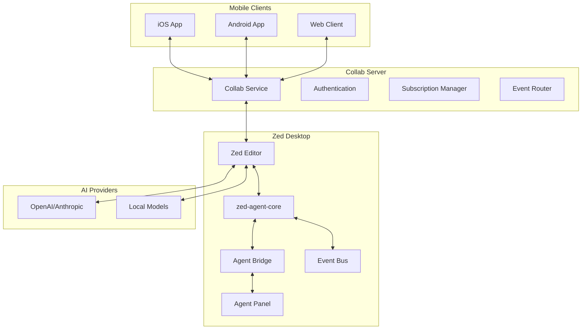

# Zed Mobile Architecture

## Overview

Zed Mobile is designed as a companion application that provides mobile access to Zed editor's agent functionality through the existing collaboration server infrastructure. The architecture leverages Zed's collab server for all communication, ensuring a unified, efficient, and secure connection model.

## High-Level Architecture



## Core Components

### 1. zed-agent-core Crate

The foundational data model and event system, providing:

```rust
// Core types without GPUI dependencies
pub struct Thread {
    pub id: String,
    pub title: Option<String>,
    pub messages: Vec<Message>,
    pub status: ThreadStatus,
    pub token_usage: TokenUsage,
}

pub struct EventBus {
    // Distributes events to multiple subscribers
}

pub enum AgentEvent {
    ThreadCreated(Thread),
    MessageAdded { thread_id: String, message: Message },
    MessageStreaming { content: String, segment_id: String },
    ToolUseStarted { tool_name: String, input: Value },
    // ... other events
}
```

**Key Design Decisions:**
- No GPUI dependencies for maximum reusability
- Event-driven architecture for loose coupling
- Serialization-friendly data structures
- Thread-safe event distribution

### 2. Collab Server Integration

The collab server acts as the central hub for all agent-related communication:

#### 2.1 Protocol Extensions
```protobuf
service AgentService {
    // Subscribe to agent events (real-time)
    rpc SubscribeToAgentEvents(SubscribeRequest) returns (stream AgentEvent);
    
    // Get historical data
    rpc GetThreads(GetThreadsRequest) returns (ThreadList);
    rpc GetThread(GetThreadRequest) returns (Thread);
    
    // Send commands from mobile
    rpc SendAgentCommand(AgentCommand) returns (CommandResponse);
}

message AgentEvent {
    oneof event {
        ThreadCreated thread_created = 1;
        MessageAdded message_added = 2;
        MessageStreaming message_streaming = 3;
        ToolUseStarted tool_use_started = 4;
        // ... other event types
    }
}
```

#### 2.2 Subscription Management
- Per-user event streams
- Thread-specific subscriptions
- Automatic cleanup on disconnect
- Event filtering and rate limiting

### 3. Desktop Integration

#### 3.1 Agent Bridge
Connects the local agent system to the collab server:

```rust
pub struct AgentCollabBridge {
    client: Arc<Client>,           // Collab client
    event_bus: Model<EventBus>,    // From zed-agent-core
    active_subscriptions: HashSet<String>,
}
```

**Responsibilities:**
- Convert core events to proto format
- Send events through collab connection
- Handle subscription lifecycle
- Manage reconnection state

#### 3.2 Event Flow
```
1. User interacts with Agent Panel
2. GPUI event generated
3. EventBridge converts to core event
4. EventBus distributes to subscribers
5. AgentCollabBridge receives event
6. Converts to proto and sends via collab
7. Collab server routes to subscribers
8. Mobile clients receive and render
```

### 4. Mobile Architecture

#### 4.1 Client Structure
```
mobile/
├── shared/              # Shared business logic
│   ├── domain/         # Core entities
│   ├── repositories/   # Data access
│   └── services/       # Business services
├── ios/                # iOS-specific code
├── android/            # Android-specific code
└── web/               # Web client code
```

#### 4.2 Connection Management
- Single persistent connection to collab server
- Automatic reconnection with exponential backoff
- State synchronization on reconnect
- Offline queue for commands

#### 4.3 State Management
```typescript
interface AppState {
    connection: ConnectionState;
    threads: Map<string, Thread>;
    activeThread: string | null;
    pendingCommands: Command[];
    syncStatus: SyncStatus;
}

interface ConnectionState {
    status: 'connected' | 'disconnected' | 'reconnecting';
    lastSync: Date;
    reconnectAttempts: number;
}
```

## Data Flow Patterns

### 1. Real-time Event Streaming
```
Desktop Agent Action → Core Event → Collab Proto → Server → Mobile Clients
```

### 2. Command Execution
```
Mobile Command → Collab Server → Desktop → Agent Execution → Event Stream
```

### 3. History Synchronization
```
Mobile Request → Collab Server → Desktop Query → Response → Mobile Update
```

## Security Architecture

### 1. Authentication
- Leverages existing Zed authentication
- JWT tokens for session management
- Device-specific credentials

### 2. Authorization
- User can only access their own agent data
- Thread-level permissions
- Rate limiting per user

### 3. Data Privacy
- End-to-end encryption for sensitive data
- No agent conversation storage on collab server
- TLS 1.3 for all connections

## Performance Considerations

### 1. Event Batching
- Configurable batch intervals (default: 50ms)
- Maximum batch size limits
- Priority-based event ordering

### 2. Mobile Optimizations
- Delta synchronization for large threads
- Lazy loading of historical messages
- Intelligent prefetching based on usage patterns

### 3. Network Efficiency
- Protocol buffer serialization
- Optional compression for large payloads
- Connection multiplexing through collab

## Scalability Design

### 1. Collab Server Scaling
- Stateless event routing
- Horizontal scaling with sticky sessions
- Redis/NATS for cross-instance communication

### 2. Client Scaling
- Progressive loading strategies
- Memory-aware caching
- Background sync for large datasets

## Error Handling & Recovery

### 1. Connection Failures
- Automatic reconnection with backoff
- Queue commands during disconnection
- Sync state on reconnection

### 2. Data Consistency
- Event ordering guarantees
- Idempotent command design
- Conflict resolution strategies

## Future Extensibility

### 1. Additional Panels
The architecture supports adding other Zed panels:
- Terminal output streaming
- Diagnostic panel integration
- Search results synchronization

### 2. Multi-Device Sync
- Sync agent state across devices
- Handoff between desktop and mobile
- Collaborative agent sessions

### 3. Cloud Features
- Cloud-based agent execution
- Shared team workspaces
- Agent conversation history

## Technology Stack

### Desktop (Zed)
- **Language**: Rust
- **UI**: GPUI
- **Networking**: Existing collab client
- **Serialization**: Protocol Buffers

### Collab Server
- **Language**: Rust
- **Protocol**: gRPC/Protocol Buffers
- **Database**: PostgreSQL
- **Caching**: Redis

### Mobile Clients
- **iOS**: Swift/SwiftUI
- **Android**: Kotlin/Compose
- **Shared Logic**: Rust (via FFI) or Kotlin Multiplatform
- **State**: SwiftUI/Compose native state

## Key Design Principles

### 1. Leverage Existing Infrastructure
- Use collab server instead of new systems
- Reuse authentication and connection management
- Build on proven patterns

### 2. Event-Driven Architecture
- Loose coupling between components
- Real-time updates as first-class citizen
- Extensible event system

### 3. Mobile-First Considerations
- Battery efficiency through single connection
- Bandwidth awareness
- Offline resilience

### 4. Security by Design
- Zero-trust architecture
- Minimal data exposure
- Strong authentication

## Implementation Phases

### Phase 1: Foundation
- Proto definitions
- Basic event routing
- Desktop integration

### Phase 2: Mobile MVP
- iOS client with basic agent panel
- Real-time event streaming
- Command execution

### Phase 3: Enhancement
- Android client
- Advanced features
- Performance optimization

### Phase 4: Scale
- Multi-device sync
- Team collaboration
- Cloud features

## Conclusion

This architecture provides a robust foundation for mobile agent access while leveraging Zed's existing infrastructure. The design prioritizes:

1. **Simplicity**: Single connection model through collab server
2. **Performance**: Efficient event streaming and batching
3. **Security**: Leveraging existing auth with strong isolation
4. **Extensibility**: Easy to add new panels and features
5. **Reliability**: Proven patterns with proper error handling

The phased approach allows incremental delivery while maintaining architectural integrity throughout the development process.